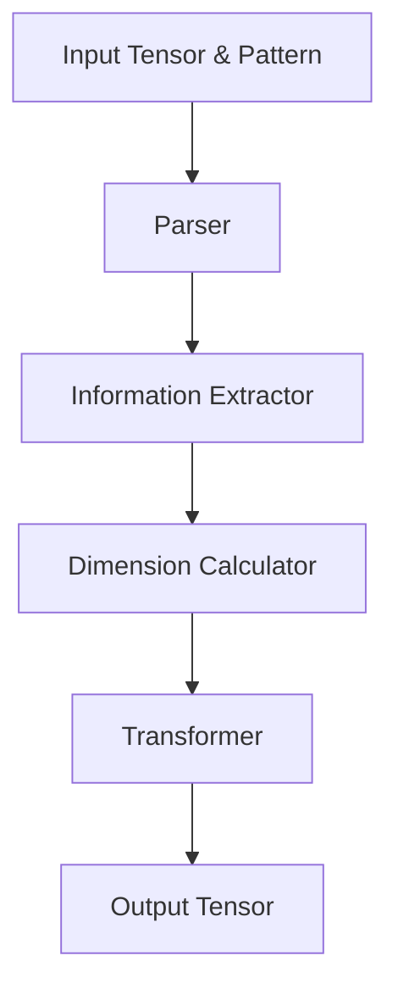

# Array Rearrange Function Implementation

Following is the description of the `rearrange` function, which supports `rearrange` and `repeat` functionality from `einops`. The module applies tensor transformations based on a pattern string just like `einops`. The approach is broken into four distinct steps:

1. **Parser**
2. **Information Extractor**
3. **Dimension Calculator**
4. **Transformer**

---

## Overview of the Process

The overall workflow for the `rearrange` function is as follows:

1. **Input Validation:**  
   The main function does input checks.

2. **Extract Transformation Details:**  
   The pattern string is processed through a parser that validates and breaks it into components.

3. **Compute Dimension Changes:**  
   The extracted information is used to determine the required reshaping, transposition, and repetition to achieve the target tensor layout.

4. **Apply Transformation:**  
   The tensor is transformed step-by-step:
   - **Initial Reshaping (if needed)**
   - **Transposition:** Reordering dimensions based on a computed permutation.
   - **Repetition:** Expanding axes where necessary.
   - **Final Reshaping:** Producing the final output tensor shape.

---

## Detailed Steps

### 1. Parser

- **Module:** `parser.py`  
- **Purpose:**  
  - Breaks down the provided pattern into a structured format.
  - Validates the presence and proper use of tokens like ellipsis (`...`), numeric dimensions (anonymous axes), and named axes. 

### 2. Information Extractor

- **Module:** `transform.py` (function: `extract_information`)  
- **Purpose:**  
  - Processes the parsed input and output patterns (obtained by splitting the pattern with `"->"`). 
  - Accounts for ellipsis by dynamically generating axis names if needed.
  - Establishes mappings for axis to corresponding positions and lengths.
  - Determines known and unknown dims for each axis, and the permutation order for transposition.

### 3. Dimension Calculator

- **Module:** `transform.py` (function: `infer_shape`)  
- **Purpose:**  
  - Computes the necessary reshaping parameters before and after the main transformation.
  - Infers unknown axis sizes by comparing known products of dimensions with actual tensor shape.
  - Determines whether an initial or final reshape is required based on the pattern structure.
  
### 4. Transformer

- **Module:** `transform.py` (function: `apply_transform`)  
- **Purpose:**  
  - Applies the computed transformations to the tensor using numpy `reshape`, `transpose` and `expand_dims`, based on the data provided by previous functions.
  - **Initial Reshape:** If the inferred shape indicates, the tensor is reshaped to an intermediate form.
  - **Transposition:** The tensor’s dimensions are reordered based on the permutation order extracted earlier.
  - **Repetition:** New axes are inserted and then broadcast to the appropriate size.
  - **Final Reshape:** If required, the tensor is reshaped into its final target dimensions.
  
---

## High-Level Flow Diagram

The design is highly modular to ensure isolation, maintainability and easier unit testing.

Below is a simple diagram illustrating the four-step process:

---

